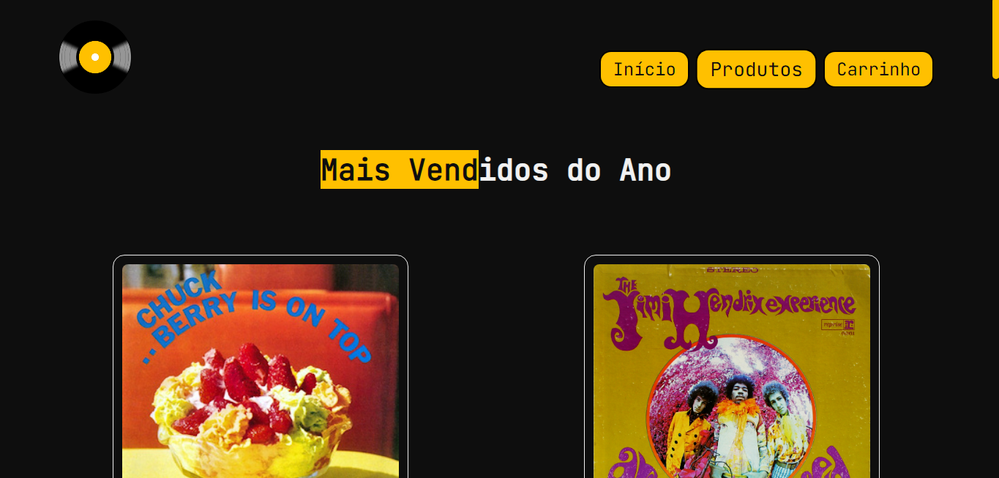

# Projeto Lado B

Projeto desenvolvido para compor a última nota avaliativa (módulos de Javascript e React) para a média final do curso de Desenvolvimento Web do Instituto Nu + Descomplica.

## 👩‍💻 O Projeto 

Foi proposto aos alunos que criássemos um e-commerce, onde deveríamos exibir os produtos de forma dinâmica e um carrinho de compras. O carrinho deve funcionar com o localStorage para manter os produtos selecionados salvos. Além disso, também deveríamos exibir no carrinho a quantidade de produtos e o valor total.

Para o meu projeto eu optei por exibir os requisitos em abas diferentes, além de uma página inicial com um breve texto apresentando a loja.

## 🔧 Tecnologias Usadas

- HTML5
- JSX
- Javascript
- React
- Styled Components
- Axios
- JSON Server
- React Router DOM

## 👷‍♀️ Melhorias

- Ajustar o bug de quantidade do cartão
- Exibir o valor total

## 🔗 Acesso 

Para acessar a loja Lado B, basta <a href="https://lado-b.vercel.app/" target="_blank">clicar aqui</a>!

##  📱 Demo

| Versão Desktop |
|----------------|
||